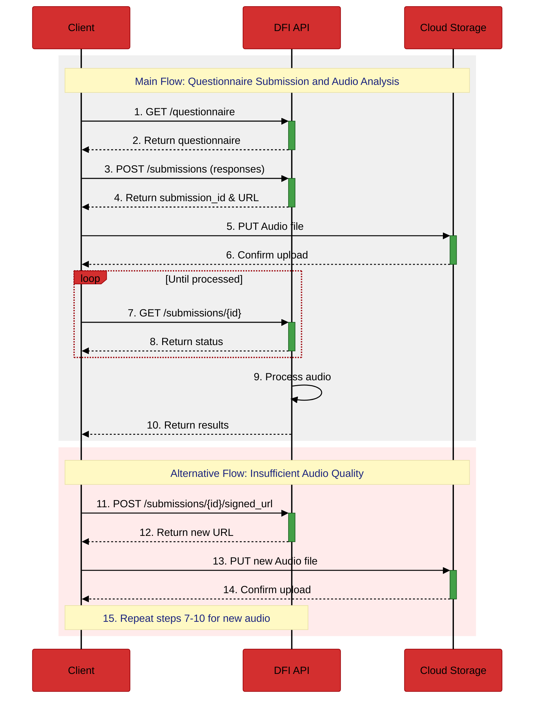

# DFI API Documentation

## Table of Contents
- [1. Introduction](#1-introduction)
  - [Swagger Documentation](#swagger-documentation)
- [2. Authentication](#2-authentication)
- [3. Errors](#3-errors)
- [4. Endpoints](#4-endpoints)
  - [GET Questionnaire](#get-questionnaire-get-questionnaire)
  - [Submit Questionnaire Responses](#submit-questionnaire-responses-post-submissions)
  - [Upload Audio](#upload-audio-via-signed-url)
  - [Fetch Results for Audio Submission](#fetch-results-for-audio-submission-get-submissionssubmission_id)
  - [Re-generate signed URL](#re-generate-signed-url-post-submissionssubmission_idsigned_url)
- [5. Versioning](#5-versioning)

## 1. Introduction
The DFI API is designed around REST principles. It features resource-oriented URLs, accepts JSON-encoded request bodies, returns JSON-encoded responses, and utilizes standard HTTP response codes, authentication, and verbs.

Our API uses an API Key for authentication, which should be included in the X-API-Key header of each request. Additionally, a unique user identifier must be provided in the X-User-ID header (must be a valid UUID) for all requests, allowing the API to tailor responses based on the user's history.

- Base URL: `https://web.decorte.tech/sonus/api/v1/`

For changelog, see [CHANGELOG.md](./CHANGELOG.md)

## Swagger Documentation
For a more detailed and interactive specification of the API requests and responses, please refer to our Swagger documentation. This resource provides a comprehensive overview of all endpoints, request parameters, response schemas, and allows you to test the API directly from your browser.
You can access the Swagger documentation at: https://decorte-future-industries-ltd.github.io/api-documentation/

## Typical Flow Diagram



This diagram illustrates the typical flow of interactions with the DFI API, including questionnaire submission, audio upload, and result retrieval.

## 2. Authentication

The DFI API requires authentication for all requests to ensure secure and authorized access. Authentication is achieved through an API Key provided in the request headers, along with a user-specific identifier.

### Required Headers:

1. **X-API-Key**: This header must include the API Key issued to you. The API Key is a unique identifier that authenticates your requests to the API. Each API Key is tied to your application or user's account and should be kept confidential.

   **Example**:
   ```http
   X-API-Key: your_api_key_here
   ```

2. **X-User-ID**: This header must include a valid UUID representing the user making the request. This unique user identifier allows the API to associate requests with a specific user's data and history, enabling personalized responses.

   **Example**:
   ```http
   X-User-ID: 123e4567-e89b-12d3-a456-426614174000
   ```

## 3. Errors

The API uses standard HTTP response codes to indicate the success or failure of requests. In addition to the HTTP status code, error responses include a JSON body with more details about the error.

### HTTP Status Code Summary

- 200: OK - Successful request
- 201: Created - Successful request that created a new resource
- 400: Bad Request - Invalid request format or parameters
- 401: Unauthorized - Missing or invalid API Key
- 403: Forbidden - Valid API Key, but insufficient permissions
- 404: Not Found - Requested resource doesn't exist
- 429: Too Many Requests - Rate limit exceeded
- 500: Internal Server Error - Unexpected server error
- 502: Bad Gateway - Invalid response from an upstream server
- 503: Service Unavailable - Server is temporarily unavailable
- 504: Gateway Timeout - Upstream server failed to respond in time

### Error Response Format

All error responses follow this format:

```json
{
  "error": {
    "code": "string",
    "message": "string",
    "details": "string" (optional)
  }
}
```

### Example Error Responses

#### 400 Bad Request
```json
{
  "error": {
    "code": "invalid_request",
    "message": "Invalid questionnaire responses",
    "details": "Question 'q3' requires a response"
  }
}
```

#### 401 Unauthorized
```json
{
  "error": {
    "code": "invalid_api_key",
    "message": "Invalid or missing API Key"
  }
}
```

#### 403 Forbidden
```json
{
  "error": {
    "code": "insufficient_permissions",
    "message": "User not authorized to access this resource"
  }
}
```

#### 404 Not Found
```json
{
  "error": {
    "code": "resource_not_found",
    "message": "Submission ID not found"
  }
}
```

#### 429 Too Many Requests
```json
{
  "error": {
    "code": "rate_limit_exceeded",
    "message": "API rate limit exceeded",
    "details": "Maximum of 100 requests per minute allowed. Please try again in 30 seconds."
  }
}
```

#### 500 Internal Server Error
```json
{
  "error": {
    "code": "internal_error",
    "message": "An unexpected error occurred",
    "details": "Error ID: 1234567890 for tracking purposes"
  }
}
```

## 4. Endpoints
### Get questionnaire: `GET /questionnaire`

This endpoint returns either an initial or follow-up questionnaire based on the user's UUID. The questionnaire content is static, but its type and length may vary based on user context.

#### Questionnaire Types

1. **Initial (`initial`)**: This is the first questionnaire presented to a new user.
2. **Follow-up (`followup`)**: This questionnaire is presented to returning users.

#### Question Types and Response Fields

The questionnaire consists of various question types. Each question type affects how it should be displayed in the client application and how the response should be formatted in the submission.

1. **Single Choice (`single_choice`)**
   - Display: A list of options where only one can be selected.
   - Response: A string representing the selected option.
   ```json
   {"question_id": "q1", "response": "Option A"}
   ```

2. **Multiple Choice (`multiple_choice`)**
   - Display: A list of options where multiple can be selected.
   - Response: An array of strings representing the selected options.
   ```json
   {"question_id": "q2", "response": ["Option A", "Option C"]}
   ```

3. **Boolean (`boolean`)**
   - Display: A yes/no or true/false question.
   - Response: A boolean value.
   ```json
   {"question_id": "q3", "response": true}
   ```

4. **Free Text (`free_text`)**
   - Display: A text input field for open-ended responses.
   - Response: A string containing the user's input.
   ```json
   {"question_id": "q4", "response": "User's detailed response here."}
   ```

5. **Number (`number`)**
   - Display: A number input field, possibly with min/max constraints.
   - Response: A number (integer or float, depending on the question).
   ```json
   {"question_id": "q5", "response": 42}
   ```

6. **Date (`date`)**
   - Display: A date picker or date input field.
   - Response: A string in ISO8601 date format (YYYY-MM-DD).
   ```json
   {"question_id": "q6", "response": "2023-10-15"}
   ```

Some questions may have additional properties:

- `required`: A boolean indicating if the question must be answered.
- `conditional_display`: An object specifying conditions under which the question should be displayed, based on responses to previous questions.

#### Request
##### Headers
```http
X-API-Key: string (required)
X-User-ID: string (required, UUID format)
```

##### Example Request
```http
GET /api/v1/questionnaire
X-API-Key: your_api_key_here
X-User-ID: 123e4567-e89b-12d3-a456-426614174000
```

#### Response
##### Success Response (200 OK)

``` json
{
  "questionnaire_id": "dfi_<client_name>_initial_v1",
  "type": "initial",
  "questions": [
    {
      "question_id": "q1",
      "text": "What is your age range?",
      "type": "single_choice",
      "options": ["18-30", "31-45", "46-60", "61-75", "76+"],
      "required": true
    },
    {
      "question_id": "q2",
      "text": "What is your gender?",
      "type": "single_choice",
      "options": ["Male", "Female", "Other", "Prefer not to say"],
      "required": true
    },
    {
      "question_id": "q3",
      "text": "Do you have any diagnosed heart conditions? (Select all that apply)",
      "type": "multiple_choice",
      "required": false,
      "options": ["Hypertension", "Arrhythmia", "Heart valve disease", "Other"],
    },
    {
      "question_id": "q4",
      "text": "If you selected 'Other' for heart conditions, please specify (optional):",
      "type": "free_text",
      "required": false,
      "conditional_display": {
        "depends_on": "q3",
        "show_if_value": "Other"
      }
    },
    {
      "question_id": "q5",
      "text": "Do you have any diagnosed respiratory conditions? (Select all that apply)",
      "type": "multiple_choice",
      "options": ["None", "Asthma", "COPD", "Sleep apnea", "Other"],
      "required": true
    },
    {
      "question_id": "q6",
      "text": "If you selected 'Other' for respiratory conditions, please specify (optional):",
      "type": "free_text",
      "required": false,
      "conditional_display": {
        "depends_on": "q5",
        "show_if_value": "Other"
      }
    },
    {
      "question_id": "q7",
      "text": "How would you rate your overall stress level? (1 = Very low, 5 = Very high)",
      "type": "single_choice",
      "options": ["1", "2", "3", "4", "5"],
      "required": true
    },
    {
      "question_id": "q8",
      "text": "How many days per week do you exercise for at least 30 minutes?",
      "type": "single_choice",
      "options": ["0 days", "1 day", "2 days", "3 days", "4 days", "5 days", "6 days", "7 days"],
      "required": true
    },
    {
      "question_id": "q9",
      "text": "Do you smoke?",
      "type": "single_choice",
      "options": ["No", "Occasionally", "Regularly"],
      "required": true
    },
    {
      "question_id": "q10",
      "text": "Do you have any other significant health conditions or recent diagnoses?",
      "type": "boolean",
      "required": true
    },
    {
      "question_id": "q11",
      "text": "Please provide details about your other health conditions or recent diagnoses (optional):",
      "type": "free_text",
      "required": false,
      "conditional_display": {
        "depends_on": "q10",
        "show_if_value": true
      }
    }
  ]
}
```

### Submit questionnaire responses: `POST /submissions`

This endpoint allows clients to submit responses to the questionnaire.

#### Request

##### Headers
```http
X-API-Key: string (required)
X-User-ID: string (required, UUID format)
```

##### Body (Schema)

```json
{
  "responses": [
    {
      "question_id": "string",
      "response": "string | number | boolean | Array"
    }
  ]
}
```

##### Example Request
```http
POST /api/v1/submissions
X-API-Key: your_api_key_here
X-User-ID: 123e4567-e89b-12d3-a456-426614174000
Content-Type: application/json

{
  "responses": [
    {"question_id": "q1", "response": "31-45"},
    {"question_id": "q2", "response": "Male"},
    {"question_id": "q3", "response": ["Hypertension", "Arrhythmia"]},
    {"question_id": "q5", "response": ["Asthma"]},
    {"question_id": "q7", "response": "3"},
    {"question_id": "q8", "response": "4"},
    {"question_id": "q9", "response": "No"},
    {"question_id": "q10", "response": false}
  ]
}
```

#### Response

##### Example: Success Response (200 OK)
```json
{
  "message": "Responses submitted successfully",
  "submission_id": "string",
  "signed_upload": {
    "url": "https://storage.googleapis.com/your-bucket-name/temp-file-<expiration-time>?GoogleAccessId=<your-access-id>&Expires=<expiration-timestamp>&Signature=<signature>",
    "expiration_time_in_seconds": 3600
  }
}
```


#### Example: Error Response (400 Bad Request)

See [Errors](#3-errors) for more details. If a request is malformed, the API will return a 400 Bad Request response with an error message describing the issue. For questionnaire responses, the "details" field is always present. It will include a list of question IDs that are missing a response.

```json
{
  "error": {
    "code": "invalid_request",
    "message": "Invalid questionnaire responses",
    "details": "Question 'q3' requires a response\nQuestion 'q6' requires a response"
  }
}
```

### Upload audio via signed URL

Signed URLs for the Google Cloud Storage bucket are returned from the submission endpoint. The URLs can expire (see "expiration_time_in_seconds" in the response), and you should re-generate them if they do. Upload the audio file to the provided URL with a PUT request. For more details, see the [Google Cloud Storage documentation](https://cloud.google.com/storage/docs/samples/storage-generate-upload-signed-url-v4). Below are examples of how to upload the file using HTTPie and cURL.

#### Request
#### Important Note

When uploading audio files, it is crucial to set the correct `Content-Type` header. For M4A audio files, use:

```
Content-Type: audio/x-m4a
```

#### Using HTTPie

```bash
http PUT "<SIGNED_UPLOAD_URL>" Content-Type:audio/x-m4a < <PATH_TO_AUDIO_FILE>
```

Replace `<SIGNED_UPLOAD_URL>` with your actual signed URL, and `<PATH_TO_AUDIO_FILE>` with the path to the file you're uploading.

#### Using cURL

```bash
curl -X PUT -H "Content-Type: audio/x-m4a" --upload-file <PATH_TO_AUDIO_FILE> "<SIGNED_UPLOAD_URL>"
```

Replace `<SIGNED_UPLOAD_URL>` with your actual signed URL, and `<PATH_TO_AUDIO_FILE>` with the path to the file you're uploading.

#### Successful Upload Response

A successful upload will return a 200 OK status. The response will include headers similar to:

```
HTTP/1.1 200 OK
ETag: "4722161d2580b1a10424d870f0ea0244"
x-goog-generation: 1728389723190920
x-goog-metageneration: 1
x-goog-stored-content-encoding: identity
x-goog-stored-content-length: 522145
```

The `ETag` can be used to verify the upload, and `x-goog-stored-content-length` confirms the size of the uploaded file.

#### Error Responses

#### SignatureDoesNotMatch Error

If you receive a 403 Forbidden error with a "SignatureDoesNotMatch" message, you'll see a response like this:

```
HTTP/1.1 403 Forbidden
Content-Type: application/xml; charset=UTF-8
Content-Length: 367

<?xml version='1.0' encoding='UTF-8'?>
<Error>
  <Code>SignatureDoesNotMatch</Code>
  <Message>Access denied.</Message>
  <Details>The request signature we calculated does not match the signature you provided. Check your Google secret key and signing method.</Details>
  <StringToSign>PUT
audio/x-m4a
1728392838
/temp-bucket/temp-file-1728389238</StringToSign>
</Error>
```

### Fetch results for audio submission: `GET /submissions/<submission_id>`

#### Request

##### Parameters

- `submission_id`: string (required) - The ID of the submission to fetch results for.
- `time_series_data`: boolean (optional) - Whether to include the time series data in the response. Defaults to false.

##### Headers
```http
X-API-Key: string (required)
X-User-ID: string (required, UUID format)
```

##### Example Request
```http
GET /api/v1/submissions/<submission_id>?time_series_data=true
X-API-Key: your_api_key_here
X-User-ID: 123e4567-e89b-12d3-a456-426614174000
```

#### Response

##### Schema

```json
{
  "status": "processing" | "processed",
  "is_quality_sufficient": "boolean",
  "metrics": {
    "heart_rate": { "value": "float", "units": "string" },
    "heart_rate_variability": { "value": "float", "units": "string" },
    "heart_murmur": "boolean",
    "time_series_data": {
      "sampling_rate": "integer",
      "audio_waveform": "array"
    }
  },
  "message": "string"
}
```

##### Example: Audio results are still being processed

```json
{
  "message": "Audio results are still being processed",
  "status": "processing"
}
```

##### Example: Audio results have been processed with the `time_series_data`

```json
{
  "message": "Audio results have been processed",
  "status": "processed",
  "is_quality_sufficient": true,
  "metrics": {
    "heart_rate": { "value": 89, "units": "bpm" },
    "heart_rate_variability": { "value": 45, "units": "ms" },
    "heart_murmur": false,
    "time_series_data": {
      "sampling_rate": 40,
      "audio_waveform": [0.01, 0.02, 0.03, 0.04, 0.05, 0.06, 0.07, 0.08, 0.09, 0.10]
    }
  }
}
```

##### Example: Audio quality is insufficient

```json
{
  "status": "processed",
  "is_quality_sufficient": false,
  "message": "Audio quality is insufficient. Please re-record and submit the audio again."
}
```

### Re-generate signed URL: `POST /submissions/<submission_id>/signed_url`

If the signed URL expires, you can re-generate it by making a POST request to the same endpoint with the same submission ID. This will return a new signed URL.

You can also re-generate the signed URL if the audio file was not deemed to be of sufficient quality.

#### Request

##### Example Request
```http
POST /api/v1/submissions/<submission_id>/signed_url
X-API-Key: your_api_key_here
X-User-ID: 123e4567-e89b-12d3-a456-426614174000
```

#### Response

The response will be the same as the "signed_upload" field in the [Submit Questionnaire Responses](#submit-questionnaire-responses-post-apiv1submissions) response, i.e.

```json
{
  "signed_upload": {
    "url": "https://storage.googleapis.com/your-bucket-name/temp-file-<expiration-time>?GoogleAccessId=<your-access-id>&Expires=<expiration-timestamp>&Signature=<signature>",
    "expiration_time_in_seconds": 3600
  }
}
```

## 5. Versioning

The DFI API uses versioning to ensure backward compatibility while allowing for future improvements and changes. We follow semantic versioning principles to make it clear when breaking changes are introduced.

### API Version

The current version of the API is v1. This is reflected in the base URL:

```
https://web.decorte.tech/sonus/api/v1/
```
